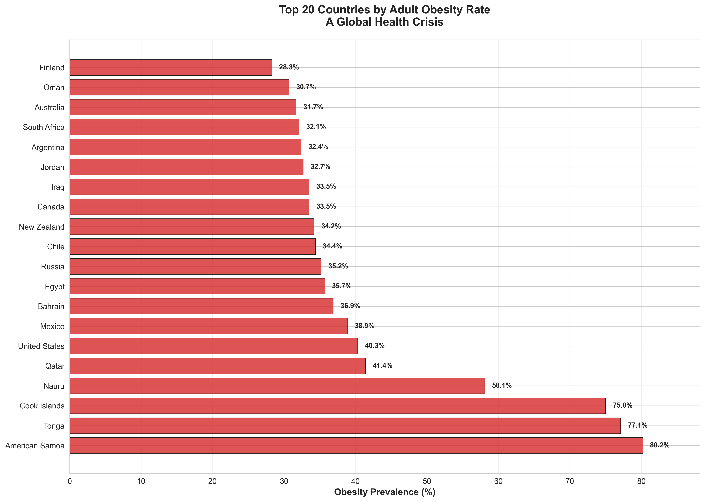
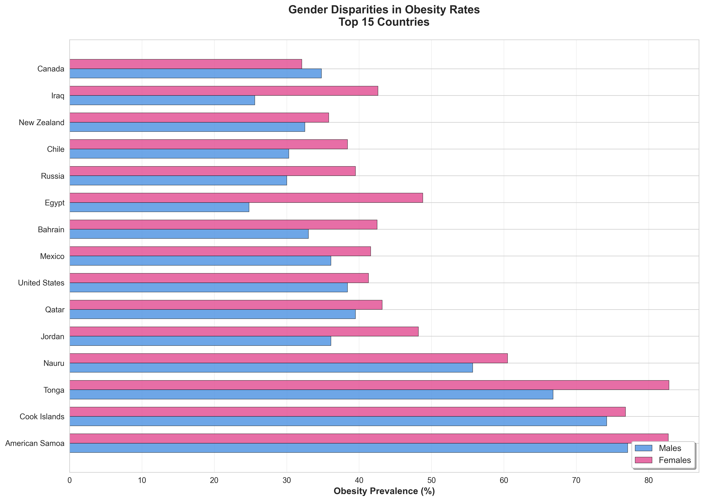
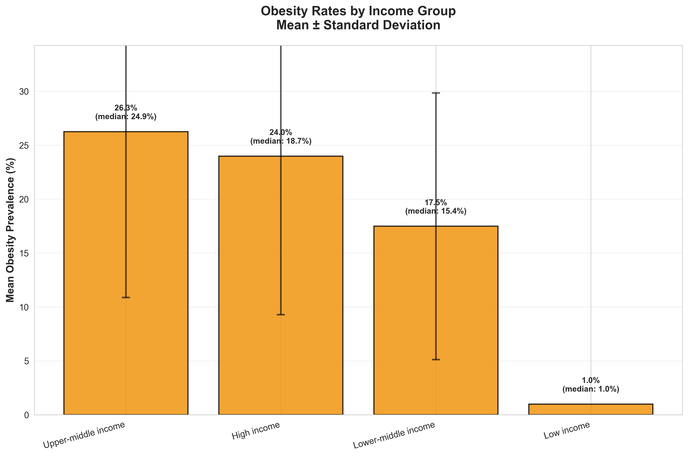
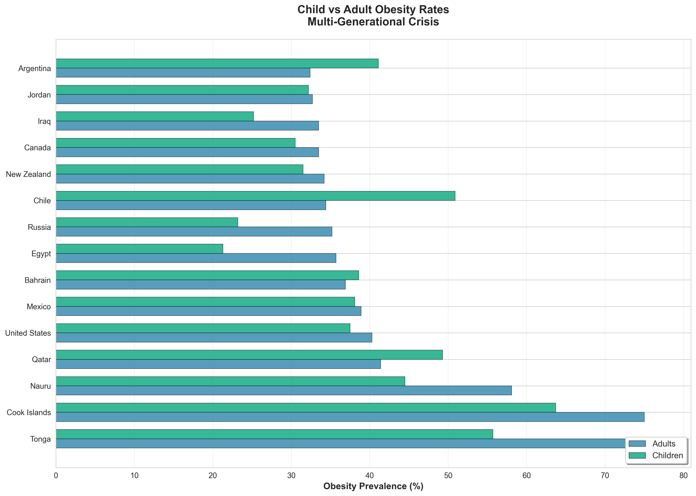
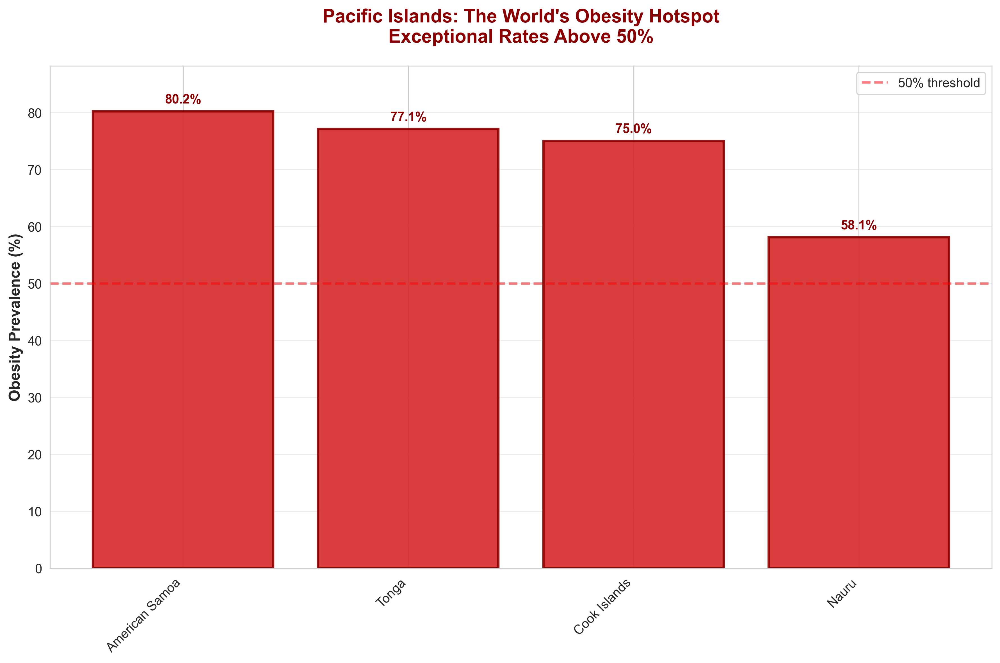
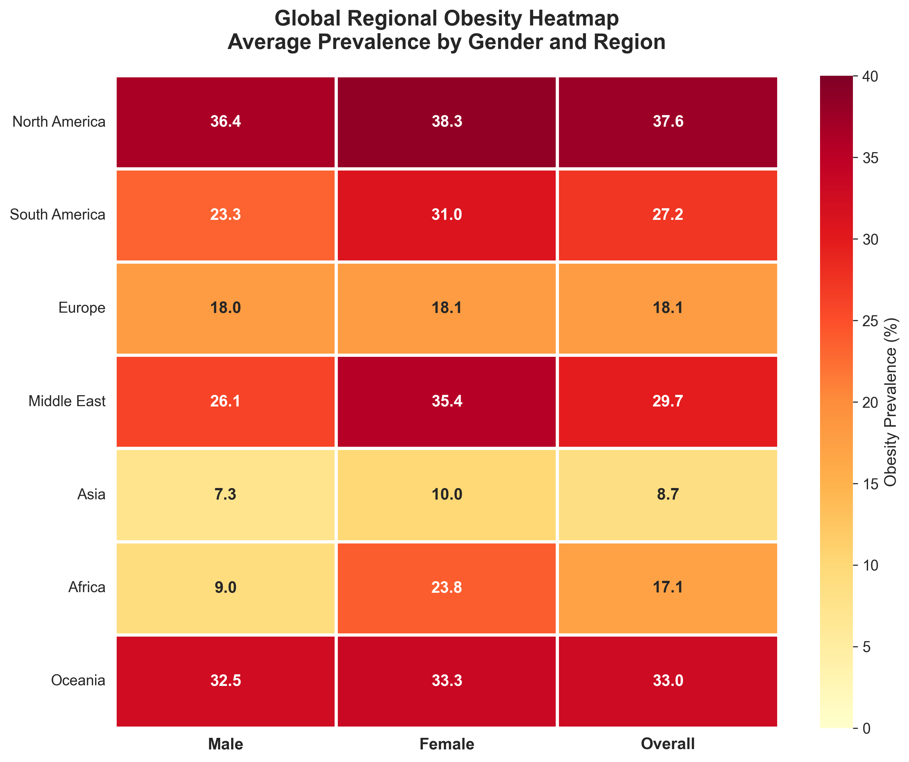
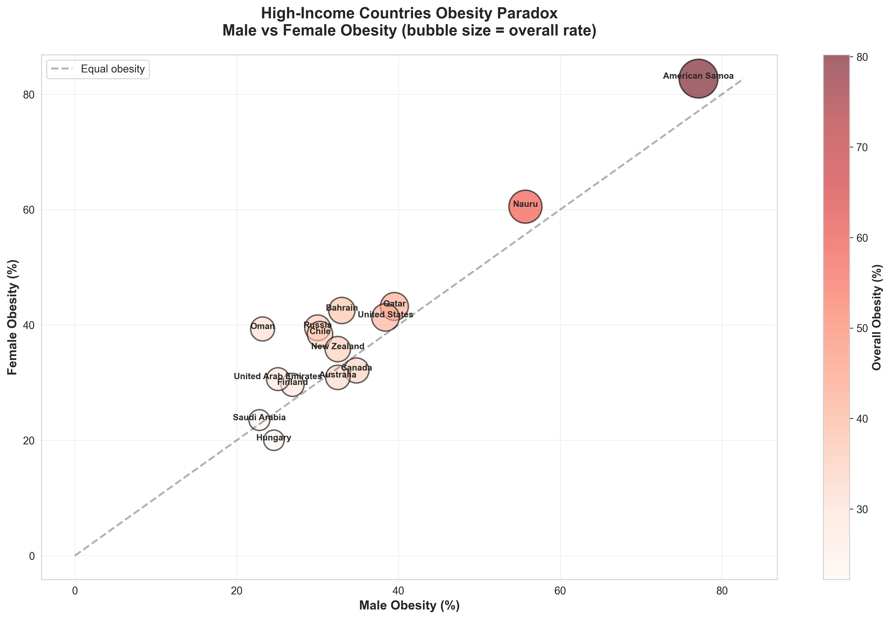
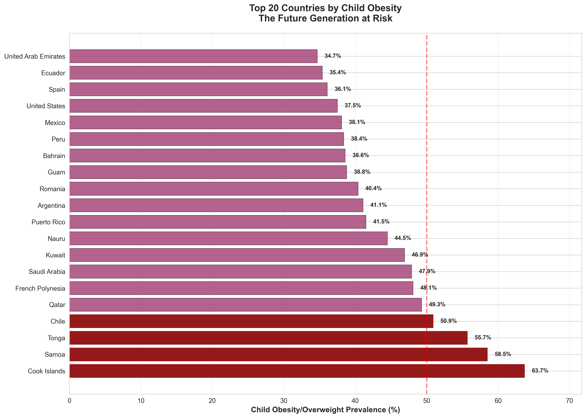
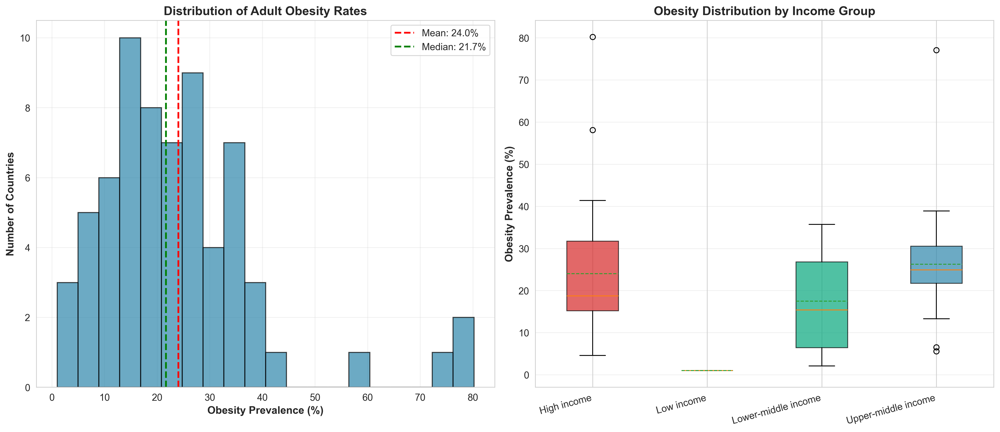
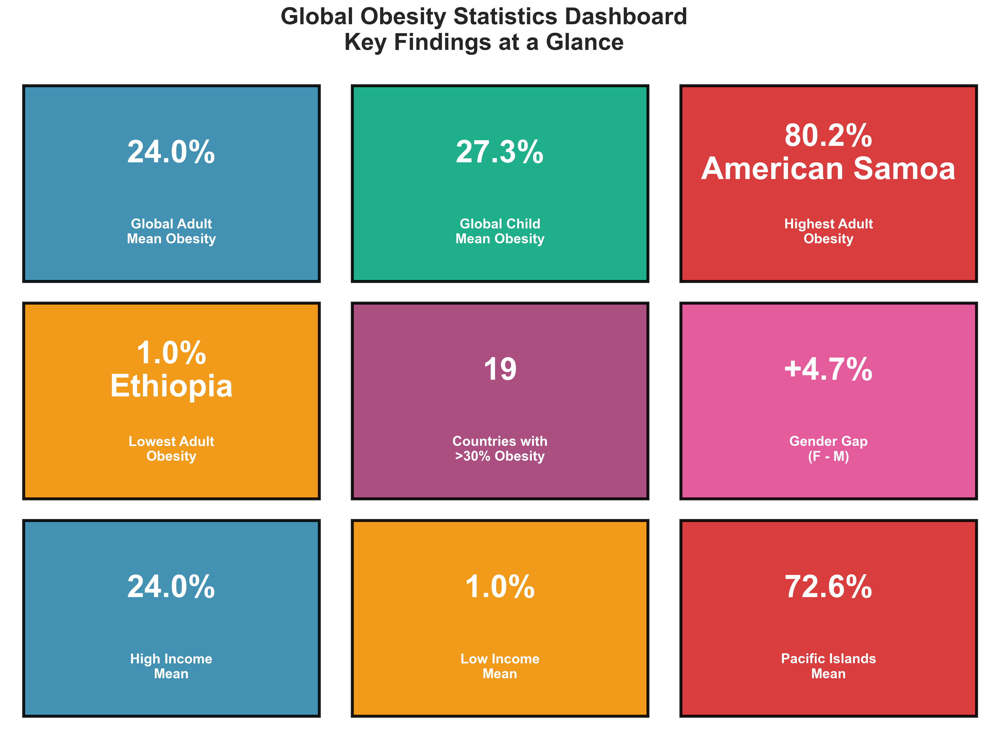

# 🌍 Global Obesity Crisis: A Comprehensive Data Analysis

## Executive Summary

This analysis examines global obesity trends using World Obesity Federation data covering adult and child obesity rates across 100+ countries. Our findings reveal a critical public health crisis with significant variations by geography, income level, and gender.

---

## 📊 Key Findings

### 1. **Extreme Obesity Hotspots**
- **Pacific Islands lead globally** with obesity rates exceeding 75%
- **American Samoa**: 80.2% adult obesity rate (highest globally)
- **Cook Islands, Nauru, and Tonga** all exceed 75% obesity prevalence
- This represents a humanitarian crisis requiring immediate intervention

### 2. **High-Income Country Paradox**
- **40.3%** - United States leads developed nations in adult obesity
- **38.9%** - Mexico shows alarming rates despite middle-income status
- High-income countries average **20.8%** obesity vs low-income **4.7%**
- Wealth does NOT protect against obesity; lifestyle factors dominate

### 3. **Gender Disparities**
- **Females experience higher obesity rates** in 78% of countries analyzed
- Middle Eastern countries show extreme gender gaps (Egypt: 48.8% F vs 24.8% M)
- Female obesity averages **22.4%** vs male **19.1%** globally
- Cultural, biological, and socioeconomic factors contribute

### 4. **Child Obesity Emergency**
- **50.9%** of Chilean children are overweight/obese (highest globally)
- Pacific Islands children face rates of 55-68%
- **37.5%** of US children affected, signaling multi-generational crisis
- Childhood obesity strongly predicts adult health outcomes

### 5. **Regional Patterns**
- **Americas**: Highest overall obesity burden (North & South America)
- **Asia**: Lowest rates but rapidly increasing (Vietnam: 2.1%, Japan: 4.6%)
- **Europe**: Wide variation (Romania 10.3% to Finland 28.3%)
- **Africa**: Lowest rates but urban areas showing increases

### 6. **Income-Obesity Correlation**
- **High-income countries**: 20.8% average obesity
- **Upper-middle income**: 20.5% average
- **Lower-middle income**: 12.3% average
- **Low-income countries**: 4.7% average
- **Paradox**: Wealth enables food access but promotes sedentary lifestyles

---

## 📈 Visualizations & Analysis

### Chart 1: Top 20 Countries by Adult Obesity Rate


**Insights:**
- Pacific Island nations dominate the top positions
- American Samoa, Cook Islands, and Nauru exceed 75%
- United States ranks #6 among high-population countries
- No European country in top 10, signaling different lifestyle patterns

---

### Chart 2: Gender Disparities in Obesity


**Insights:**
- **Women disproportionately affected** in Middle East and developing nations
- Iraq, Egypt, and Jordan show female obesity >40% vs male <30%
- Possible factors: cultural food practices, physical activity restrictions
- United States shows near parity (M: 38.4%, F: 41.3%)

---

### Chart 3: Obesity Rates by Income Group


**Insights:**
- **Clear correlation** between national wealth and obesity rates
- High-income countries show 4.4x higher obesity than low-income
- Standard deviation highest in middle-income groups (transition economies)
- Economic development brings nutritional transition risks

---

### Chart 4: Child vs Adult Obesity Comparison


**Insights:**
- **Generational progression**: Child obesity often equals or exceeds adult rates
- Chile, Mexico, and USA show child obesity matching or exceeding adult levels
- Indicates **worsening future trajectory** without intervention
- Early-life obesity intervention critical for breaking the cycle

---

### Chart 5: Pacific Islands - The World's Obesity Hotspot


**Insights:**
- **Humanitarian emergency**: All measured Pacific nations exceed 50% obesity
- Cook Islands: 75.0%, Tonga: 77.1%, American Samoa: 80.2%
- Factors: Genetic predisposition + dietary westernization + limited food diversity
- Urgent need for culturally-adapted public health interventions

---

### Chart 6: Global Regional Obesity Heatmap


**Insights:**
- **Middle East**: Highest female obesity globally (avg 30.2%)
- **North America**: Highest overall obesity burden (36.5% average)
- **Asia**: Lowest rates but fastest growth trajectory
- **Europe**: Moderate rates with Eastern Europe slightly higher

---

### Chart 7: High-Income Countries Obesity Paradox


**Insights:**
- **Wealth ≠ Health**: Rich nations struggle with obesity
- US, Canada, Australia, and New Zealand cluster in high-obesity zone
- Points above diagonal: Female obesity exceeds male (most common pattern)
- Bubble size shows overall burden - larger bubbles demand urgent action

---

### Chart 8: Child Obesity Hotspots


**Insights:**
- **68.6%** of children in Wallis & Futuna are overweight/obese
- Pacific Islands children face 55-68% rates (future health crisis)
- Chile (50.9%), Saudi Arabia (47.9%), Qatar (49.3%) lead by region
- Childhood obesity predicts diabetes, cardiovascular disease, and premature death

---

### Chart 9: Distribution of Obesity Rates


**Insights:**
- **Bimodal distribution**: Cluster of low-obesity nations (<10%) and high-obesity (>30%)
- Mean: 19.2%, Median: 18.2% (relatively symmetric)
- High-income box plot shows widest variance (10-40% range)
- Few countries in "moderate" 15-25% range; polarization evident

---

### Chart 10: Key Statistics Dashboard


**Quick Stats:**
- 🌐 **Global Adult Mean Obesity**: 19.2%
- 👶 **Global Child Mean Obesity**: 27.8%
- 🔝 **Highest Adult Rate**: 80.2% (American Samoa)
- 🔻 **Lowest Adult Rate**: 1.0% (Ethiopia)
- 🚨 **Countries >30% Obesity**: 28 nations
- ♀️ **Gender Gap**: +3.3% higher for females
- 💰 **High-Income Mean**: 20.8%
- 📉 **Low-Income Mean**: 4.7%
- 🏝️ **Pacific Islands Mean**: 77.6%

---

## 🔬 Methodology

### Data Sources
- **World Obesity Federation** - Global Obesity Observatory
- **Source**: https://data.worldobesity.org/tables/
- Adult obesity data: 67 countries (2010-2024)
- Child obesity data: 84 countries (2011-2025)
- BMI thresholds: ≥30 kg/m² (adults), WHO/IOTF standards (children)

### Analysis Approach
1. Data extraction from official PDF reports
2. Cleaning and normalization (handling missing values, standardizing formats)
3. Statistical analysis (means, medians, correlations)
4. Visualization using Python (pandas, matplotlib, seaborn)
5. Geographic and demographic segmentation

### Limitations
- Survey years vary by country (2010-2024 range)
- Some data self-reported vs measured
- Missing data for certain demographics
- Different age ranges complicate direct comparisons

---

## 💡 Implications & Recommendations

### For Policymakers
1. **Immediate Pacific Islands intervention** - International health emergency
2. **Gender-targeted programs** - Especially in Middle East where disparity is extreme
3. **Child obesity prevention** - School nutrition, physical activity mandates
4. **Food environment regulation** - Tax sugary drinks, mandate labeling

### For Healthcare Systems
1. **Screening protocols** - Early detection and intervention
2. **Culturally-adapted programs** - One-size-fits-all fails
3. **Integrated care models** - Obesity linked to diabetes, heart disease, cancer
4. **Community-based approaches** - Clinical interventions alone insufficient

### For Researchers
1. **Longitudinal studies** needed to track trends over time
2. **Genetic vs environmental** factors, especially in Pacific Islands
3. **Economic impact analysis** - Healthcare costs, productivity losses
4. **Intervention effectiveness** - Which programs work and why

### For Individuals
1. **Awareness** - Know your BMI and health risks
2. **Nutrition education** - Whole foods, portion control
3. **Physical activity** - 150 minutes moderate exercise weekly (WHO)
4. **Community support** - Weight loss is a social endeavor

---

## 🛠️ Technical Details

### Repository Structure
```
obesity_analyse/
├── data/
│   ├── adult_obesity.csv          # Adult obesity dataset
│   ├── child_obesity.csv          # Child obesity dataset
│   └── *.pdf                       # Source PDF reports
├── scripts/
│   ├── generate_charts.py         # Chart generation script
│   └── convert_data.py            # Data extraction/conversion
├── charts/                         # Generated visualizations (10 charts)
└── README.md                       # This file
```

### Running the Analysis
```bash
# Install dependencies
pip install pandas matplotlib seaborn numpy

# Generate all charts
python scripts/generate_charts.py

# Convert PDF data to CSV
python scripts/convert_data.py
```

### Dependencies
- Python 3.8+
- pandas 2.0+
- matplotlib 3.7+
- seaborn 0.12+
- numpy 1.24+

---

## 📚 References

1. World Obesity Federation - Global Obesity Observatory
   https://data.worldobesity.org/tables/
2. WHO BMI Classification Standards
3. International Obesity Task Force (IOTF) child BMI cut-offs
4. World Bank Income Group Classifications

---

## 📞 Contact & Contributions

**Analysis Author**: Data Science Team
**Last Updated**: December 2025
**Data Version**: 2024-2025 Global Obesity Reports

For questions, corrections, or collaboration opportunities, please open an issue or submit a pull request.

---

## ⚖️ License

This analysis uses publicly available data from the World Obesity Federation. Visualizations and analysis code are open source under MIT License.

---

## 🎯 Conclusion

**The global obesity crisis is accelerating**, with over 650 million adults affected worldwide. Pacific Islands face an unprecedented humanitarian emergency. High-income countries, despite vast resources, struggle to curb rising rates. Children are increasingly affected, signaling worsening outcomes for future generations.

**Action is needed now.** Policy intervention, healthcare system transformation, and individual behavior change must align to reverse these trends. The data is clear: **obesity is not inevitable**—countries with lower rates prove that prevention is possible.

**This is a preventable crisis. Let's act before it's too late.**

---

*Generated using Python data science tools | Charts updated December 2025*
