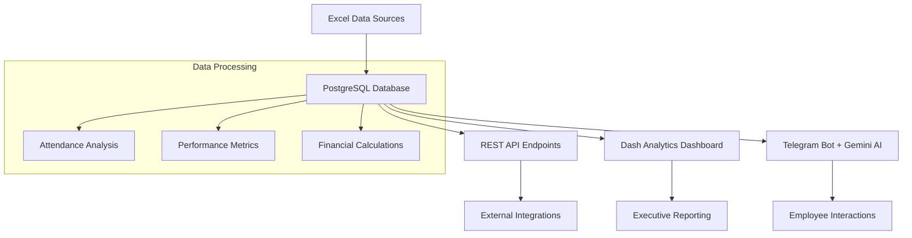

# 🏢 ICTA Employee Analytics System

A comprehensive, multi-component employee performance analytics platform featuring a Telegram bot with AI capabilities, an interactive web dashboard, and advanced data processing tools. Built for modern HR analytics and real-time employee performance management.

## 🌐 Live Applications

| Component | URL | Description |
|-----------|-----|-------------|
| 📊 **Interactive Dashboard** | [https://icta-dataanalyst-1.onrender.com/](https://icta-dataanalyst-1.onrender.com/) | Executive analytics dashboard |
| 🤖 **Telegram Bot + API** | [https://icta-dataanalyst.onrender.com](https://icta-dataanalyst.onrender.com) | AI-powered bot & REST API |
| 💬 **Telegram Bot** | [@icta_analyst_bot](https://t.me/icta_analyst_bot) | Interactive AI assistant |

## 📋 Project Overview

This system transforms raw employee attendance data into actionable business insights through three integrated components:

### 🎯 **Core Components**

1. **📊 Analytics Dashboard** - Executive-level visual analytics
2. **🤖 AI-Powered Telegram Bot** - Interactive employee data analysis  
3. **🔗 REST API** - Programmatic data access
4. **🗄️ Database System** - PostgreSQL with comprehensive data storage

## 🏗️ System Architecture



## 📊 Data Pipeline

### **Data Sources → Processing → Insights**
```
Excel Files (6 sources)
    ↓
PostgreSQL Database (icta schema)
    ↓
Real-time Analytics Engine
    ↓
Multi-channel Delivery (Dashboard, Bot, API)
```

### **Database Schema (icta schema)**
| Table | Records | Description |
|-------|---------|-------------|
| `attendance` | 246 rows | Daily attendance with entry/exit times |
| `holiday` | 3 rows | Employee leave periods |
| `permission` | 6 rows | Permission/break records |
| `data` | 192 rows | Processed work hours and calculations |
| `monthly_fines_bonuses` | 12 rows | Monthly performance summaries |
| `task_1`, `task_2` | 248, 20 rows | Task-specific datasets |

## 🚀 Quick Start

### Prerequisites
- Python 3.9+
- PostgreSQL database
- Telegram Bot Token
- Google Gemini API Key

### 1. Clone & Setup
```bash
git clone <repository-url>
cd ICTA_DataAnalyst

# Create virtual environment
python -m venv venv
source venv/bin/activate  # On Windows: venv\Scripts\activate
```

### 2. Environment Configuration
```bash
# Copy environment template
cp .env.example .env

# Edit .env with your credentials
nano .env
```

### 3. Install Dependencies
```bash
# For Dashboard
cd dashboard
pip install -r requirements.txt

# For Telegram Bot + API
cd ../telegram  
pip install -r requirements.txt
```

### 4. Run Components

#### Dashboard
```bash
cd dashboard
python dashboard.py
# Access: http://localhost:8050
```

#### Telegram Bot + API
```bash
cd telegram
python app.py
# API: http://localhost:8000
# Bot: Active on Telegram
```

## 📱 Component Details

### 📊 Analytics Dashboard
**URL**: [https://icta-dataanalyst-1.onrender.com/](https://icta-dataanalyst-1.onrender.com/)

#### Features:
- **📈 Executive Overview**: KPIs, performance summaries, top performers
- **👥 Employee Analysis**: Individual metrics, productivity scoring, performance matrix
- **🏢 Department Performance**: Efficiency analysis, radar charts, comparisons
- **💰 Financial Impact**: Bonus/fine analysis, ROI calculations, net impact
- **📊 Trends & Insights**: Time series, AI recommendations, pattern recognition

#### Technologies:
- **Frontend**: Dash + Plotly (Interactive visualizations)
- **Backend**: Python + Pandas (Data processing)
- **Database**: PostgreSQL + SQLAlchemy (Real-time queries)
- **Deployment**: Gunicorn + Render

### 🤖 Telegram Bot + API
**Bot**: [@icta_analyst_bot](https://t.me/icta_analyst_bot) | **API**: [https://icta-dataanalyst.onrender.com](https://icta-dataanalyst.onrender.com)

#### Bot Features:
- **🧠 AI Analysis**: Natural language queries powered by Google Gemini
- **📊 Visual Analytics**: Auto-generated charts and performance reports
- **💬 Interactive Commands**: `/start`, `/analytics`, `/ai`, `/attendance`
- **🔍 Smart Insights**: Context-aware responses and recommendations

#### API Endpoints:
- `GET /` - API status and information
- `GET /attendance` - Employee attendance records
- `GET /holiday` - Holiday and leave data
- `GET /permission` - Permission and break records
- `GET /data` - Processed performance metrics
- `GET /monthly_fines_bonuses` - Monthly calculations
- `GET /task_1`, `/task_2` - Task-specific datasets

#### Technologies:
- **Bot Framework**: python-telegram-bot (Webhook-based)
- **AI Engine**: Google Gemini 1.5 Flash
- **API Framework**: FastAPI (Async endpoints)
- **Database**: PostgreSQL (Real-time connectivity)
- **Deployment**: Uvicorn + Render

## 📈 Business Intelligence Features

### 🎯 Key Performance Indicators
- **Employee Productivity Score**: `Overtime - Delays`
- **Department Efficiency**: `Overtime / (Delays + 1)`
- **Financial Impact**: `Total Bonuses - Total Fines`
- **Attendance Patterns**: Daily/monthly trend analysis

### 💰 Financial Calculations

#### Fine Structure:
- Delay > 3 hours: 2% fine
- Delay > 10 hours: 3% fine
- Delay > 20 hours: 5% fine

#### Bonus Structure:
- Overtime > 3 hours: 2% bonus
- Overtime > 10 hours: 3% bonus
- Overtime > 20 hours: 5% bonus

### 🧠 AI-Powered Insights
- Automated performance recommendations
- Trend pattern recognition
- Department comparison analysis
- Employee recognition suggestions
- Attendance issue identification

## 🛠️ Technical Stack

### **Backend Technologies**
- **Language**: Python 3.9+
- **Web Frameworks**: FastAPI, Dash
- **Database**: PostgreSQL + SQLAlchemy
- **AI/ML**: Google Gemini API
- **Data Processing**: Pandas, NumPy

### **Frontend Technologies**
- **Visualization**: Plotly, Dash
- **Styling**: Custom CSS, Responsive design
- **Interactive Elements**: Dash callbacks, Real-time updates

### **Infrastructure**
- **Deployment**: Render (Multiple services)
- **Database Hosting**: Neon PostgreSQL
- **Environment Management**: python-dotenv
- **Process Management**: Gunicorn, Uvicorn

### **Integration & APIs**
- **Telegram API**: Bot messaging and webhooks
- **Google Gemini**: Natural language processing
- **PostgreSQL**: Real-time data queries
- **REST APIs**: Cross-platform data access

## 📁 Project Structure

```
ICTA_DataAnalyst/
├── 📊 dashboard/              # Analytics Dashboard
│   ├── dashboard.py           # Main dashboard application
│   ├── requirements.txt       # Dashboard dependencies
│   └── README.md             # Dashboard documentation
├── 🤖 telegram/              # Bot + API
│   ├── app.py                # Combined FastAPI + Telegram bot
│   ├── requirements.txt       # Bot/API dependencies
│   └── README.md             # Bot documentation
├── 📂 data/                  # Original Excel files
│   ├── attendance.xlsx        # Employee attendance data
│   ├── holiday.xlsx          # Holiday/leave records
│   ├── permission.xlsx       # Permission data
│   ├── monthly_fines_bonuses.xlsx
│   ├── data.xlsx             # Processed data
│   └── task.xlsx             # Task specifications
├── 🔬 analyse/               # Data analysis notebooks
│   └── analyse.ipynb         # Jupyter analysis
├── 📄 .env.example           # Environment template
├── 📄 .env                   # Environment variables (private)
├── 📋 Tasks.md               # Project requirements
└── 📖 README.md              # This file
```

## 🔧 Configuration

### Environment Variables
```env
# Database Configuration
PGHOST=your_postgres_host
PGDATABASE=your_database_name
PGUSER=your_database_user
PGPASSWORD=your_database_password

# Telegram Bot
BOT_TOKEN=your_telegram_bot_token

# AI APIs
GEMINI_API_KEY=your_google_gemini_api_key

# Optional
RENDER_EXTERNAL_URL=https://your-app.onrender.com
USE_WEBHOOK=false
```

### Database Setup
The system uses PostgreSQL with the `icta` schema containing processed employee data:

```sql
-- Example data structure
SELECT * FROM icta.attendance LIMIT 5;
SELECT * FROM icta.monthly_fines_bonuses;
SELECT * FROM icta.data WHERE "Employee" = 'Aynur';
```

## 🚀 Deployment

### Dashboard Deployment (Render)
```bash
# Build Command
pip install -r requirements.txt

# Start Command  
gunicorn dashboard:server

# Environment Variables
PGHOST, PGDATABASE, PGUSER, PGPASSWORD
```

### Bot + API Deployment (Render)
```bash
# Build Command
pip install -r requirements.txt

# Start Command
python app.py

# Environment Variables
PGHOST, PGDATABASE, PGUSER, PGPASSWORD, BOT_TOKEN, GEMINI_API_KEY
```

## 📊 Usage Examples

### Dashboard Analytics
1. **Executive Overview**: Monitor company-wide performance KPIs
2. **Employee Deep-dive**: Analyze individual performance metrics
3. **Department Comparison**: Compare efficiency across teams
4. **Financial Analysis**: Track bonus/fine distributions
5. **Trend Analysis**: Identify performance patterns

### Telegram Bot Interactions
```
User: "Which employee has the most overtime this month?"
Bot: "Based on the latest data, Aynur from IT has the highest overtime with 25.17 hours this month, earning a 5% bonus for exceptional performance."

User: "Compare IT and Marketing departments"
Bot: "Department Analysis: IT shows higher average overtime (20.7h) but Marketing has better attendance consistency. IT generates more bonuses but also incurs more overtime costs."

User: "/analytics"
Bot: [Sends comprehensive performance charts]
```

### API Integration
```bash
# Get attendance data
curl https://icta-dataanalyst.onrender.com/attendance

# Get monthly summaries
curl https://icta-dataanalyst.onrender.com/monthly_fines_bonuses

# Check API status
curl https://icta-dataanalyst.onrender.com/
```

## 🔍 Data Flow

### 1. Data Ingestion
- Excel files uploaded to PostgreSQL `icta` schema
- 6 data sources covering attendance, holidays, permissions, and calculations
- Automated data processing and relationship mapping

### 2. Real-time Processing
- Live database queries for current metrics
- On-demand calculations for KPIs and insights
- Performance optimization through SQLAlchemy

### 3. Multi-channel Delivery
- **Dashboard**: Visual analytics for executives and managers
- **Telegram Bot**: Interactive AI-powered employee queries
- **REST API**: Programmatic access for integrations

## 🎯 Key Features

### 🧠 AI-Powered Analytics
- **Natural Language Processing**: Ask questions in plain English
- **Context-Aware Responses**: Understands business terminology
- **Automated Insights**: Identifies trends and patterns
- **Recommendation Engine**: Suggests actions based on data

### 📊 Advanced Visualizations
- **Interactive Charts**: Plotly-powered dashboards
- **Real-time KPIs**: Live performance indicators
- **Comparative Analysis**: Department and employee comparisons
- **Financial Metrics**: ROI and cost-benefit analysis

### 🔗 Seamless Integration
- **Multi-platform Access**: Web dashboard, Telegram bot, REST API
- **Real-time Data**: Always current with database sync
- **Webhook-based Bot**: Production-ready Telegram integration
- **RESTful API**: Standard endpoints for external systems

## 🔒 Security & Performance

### Security Features
- Environment variable configuration
- SQL injection prevention via SQLAlchemy
- Webhook authentication for Telegram
- Connection pooling for database optimization

### Performance Optimization
- Efficient database queries with proper indexing
- Connection pooling for high-concurrency access
- Lazy loading for dashboard components
- Optimized SQL queries for real-time analytics

## 📈 Metrics & Analytics

### Business Metrics
- **Employee Performance**: 246 attendance records analyzed
- **Department Efficiency**: IT vs Marketing comparisons
- **Financial Impact**: Bonus/fine calculations and ROI
- **Productivity Trends**: Monthly and daily pattern analysis

### Technical Metrics
- **Database**: PostgreSQL with 6 optimized tables
- **API Performance**: FastAPI with async endpoints
- **Bot Responsiveness**: Webhook-based real-time messaging
- **Dashboard Load Time**: Optimized Plotly visualizations

## 🤝 Contributing

### Development Setup
```bash
# Clone repository
git clone <repository-url>
cd ICTA_DataAnalyst

# Set up environment
cp .env.example .env
# Edit .env with your credentials

# Install dependencies for each component
cd dashboard && pip install -r requirements.txt
cd ../telegram && pip install -r requirements.txt
```

### Adding Features
1. **Dashboard**: Add new visualization functions in `dashboard/dashboard.py`
2. **Bot**: Extend AI capabilities in `telegram/app.py`
3. **API**: Add new endpoints in the FastAPI application
4. **Database**: Extend schema with new analytical tables

## 🔮 Future Enhancements

### Planned Features
- [ ] Real-time data refresh for dashboard
- [ ] Advanced ML predictions for performance forecasting
- [ ] Mobile app integration with push notifications
- [ ] Custom alert systems for performance thresholds
- [ ] Integration with popular HR management systems

### Potential Integrations
- [ ] Slack bot for team notifications
- [ ] Email reporting automation
- [ ] Microsoft Teams integration
- [ ] Calendar sync for attendance tracking
- [ ] Payroll system integration

## 📚 Documentation

### Component Documentation
- **Dashboard**: [dashboard/README.md](dashboard/README.md)
- **Telegram Bot**: [telegram/README.md](telegram/README.md)
- **API Reference**: Available at `/docs` endpoint
- **Database Schema**: Documented in data analysis notebooks

### Technical References
- [Dash Documentation](https://dash.plotly.com/)
- [FastAPI Documentation](https://fastapi.tiangolo.com/)
- [python-telegram-bot](https://python-telegram-bot.readthedocs.io/)
- [Google Gemini API](https://ai.google.dev/)

## 📞 Support & Contact

### Troubleshooting
1. Check environment variable configuration
2. Verify database connectivity
3. Ensure API keys are valid
4. Review deployment logs

### Live Applications
- **Dashboard**: [https://icta-dataanalyst-1.onrender.com/](https://icta-dataanalyst-1.onrender.com/)
- **API**: [https://icta-dataanalyst.onrender.com](https://icta-dataanalyst.onrender.com)
- **Bot**: [@icta_analyst_bot](https://t.me/icta_analyst_bot)

---

**🚀 Project Status**: Fully deployed and operational with comprehensive employee analytics, AI-powered insights, and multi-platform accessibility!

**🎯 Built for**: ICTA Data Analyst Assessment - Comprehensive employee performance management system